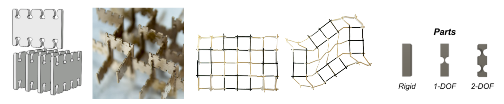
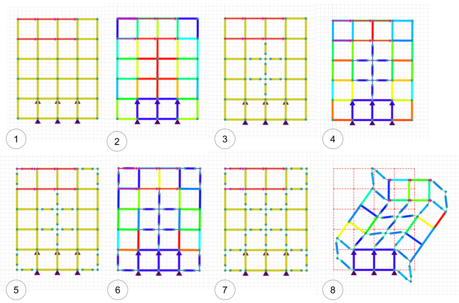

# Computational Structural Design and Optimization

For a computational structural design and optimization class, I developed a design and simulation tool for discretely assembled mechanisms.

My research in digital materials (in the Center for Bits and Atoms) looks to enable the "printing" complex systems in a single process. However, rather than achieving this through the use of additive-manufacturing, we're focusing on discrete assembly of individual building blocks.

One such application of this discrete assembly method is in the construction of mechanical mechanisms: with just four part-types (rigid, 1 degree-of-freedom, 2 degree-of-freedom, and vacant) a large diversity of mechansims can be assembled.

Designing and simulating these kinds of assemblies with conventional solidmodeling tools can be tedious and innacurate (given the large deformations). For this project, I aimed to create a tool which puts design and simulation in very close proximity to enable fast iteration and exploration of the discrete assembly design space.

More details about this project can be found in our write-up, <a href="images/Design and Optimization Tools for Discretely Assembled Mechansims – Final.pdf">here</a>.