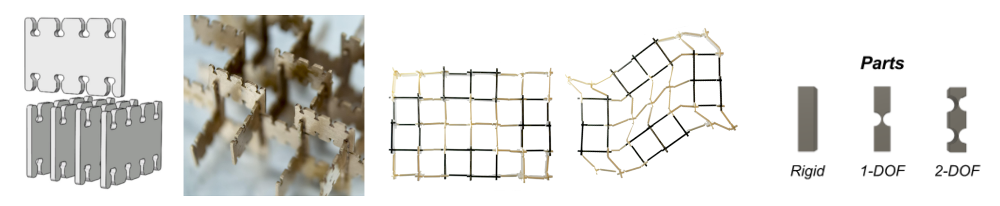
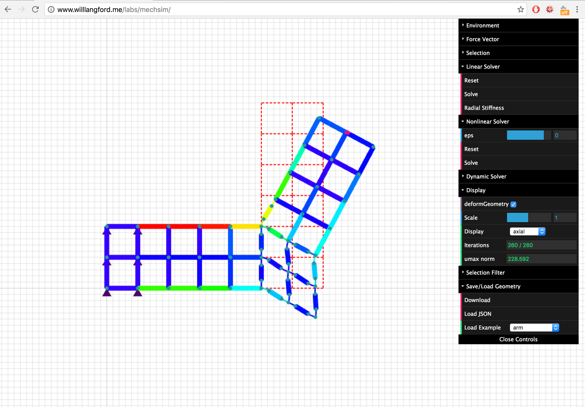
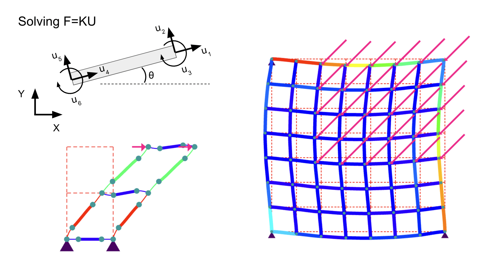
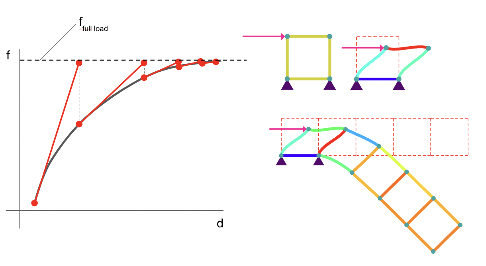
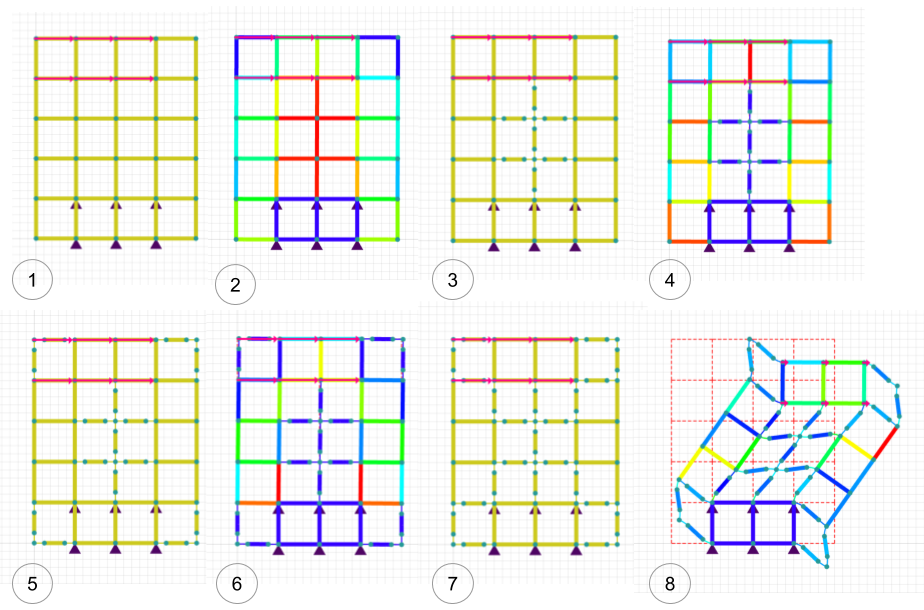

# Computational Structural Design and Optimization

For a computational structural design and optimization class, I developed a design and simulation tool for discretely assembled mechanisms.

My recent research has looked at an alternative approach to conventional additive manufacturing in which functional devices are assembled from individual millimeter scale parts.

These parts have embedded degrees of freedom that enable certain kinds of motion and through their composition, a variety of mechanisms can be assembled.

But simulating these mechanisms can be tedious or inaccurate using conventional design and simulation tools.

Furthermore, since the discrete design space is not inherently intuitive,

We need a design tool that puts design and simulation in close proximity to allow rapid experimentation and exploration of the design space.

So, given that goal, I built this tool which enables the rapid design, simulation, and analysis of planar mechanisms assembled from discrete parts.

I’ll first do a quick run through some of background details regarding my implementation and then hopefully show a live demo.

The first step in implementing this tool was to develop a finite element solver.

Since the mechanisms are planar, and the parts themselves are relatively slender compared with their length, they can be modeled quite well by frame elements.

Each element has six degrees of freedom: with each node having two translation and one rotational degree of freedom. 

Given a specified geometry and connectivity of the elements, the solver works by assembly a system stiffness matrix: effectively forming a large system of linear equations. 

Solving this system of equations gives you the displacement of each degree of freedom given the applied loads.

This works well for determining the forces in structures and for analysis of small deformations, but doesn’t accurately capture large deformations: especially those with large rotational motions.

Since we expect these mechanisms to deform significantly, we need a way to apply this technique without the small-angle approximations.

Again, there are a few different ways to do this but I’ve chosen to implement a linear incremental solver which simply breaks up the applied load into small chunks and solves the system in small linear steps.

You can break up this load intelligently using techniques like newton’s method. This enables the simulation of very compliant mechanisms, while also giving the user an indication of the flow of forces through the members.

Using this simulation tool, we can then wrap a topology optimization around it to design a mechanism that has low stiffness in some directions but high stiffness in others.

More details about this project can be found in our write-up, <a href="images/Design and Optimization Tools for Discretely Assembled Mechansims – Final.pdf">here</a>.